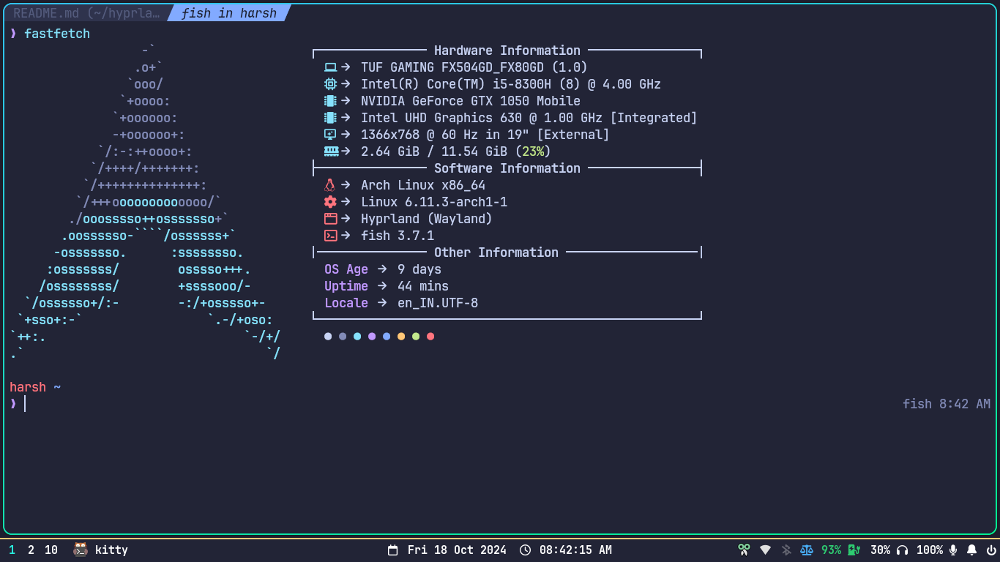

# Hyprland Setup

> [!WARNING]
> This repo installation script only works fedora and arch

## `FAQ:` How To install?

Just run `.scripts/install.sh` to setup my configuration (Fedora and Arch Users Only).

## `FAQ:` How To remove?

Just run `.scripts/remove.sh` to remove my configuration (Fedora and Arch Users Only).

1. Desktop

2. Tab Open

