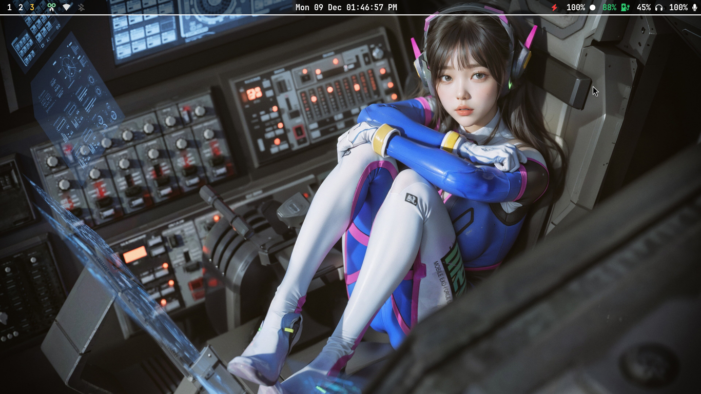

# Hyprland Setup

> [!NOTE]
>
> - My setup is heavily based on `gnome`, So you need to have `gnome` DE in your system before installing this setup.
> - Also, script only runs in `archlinux`.

## Screenshots

